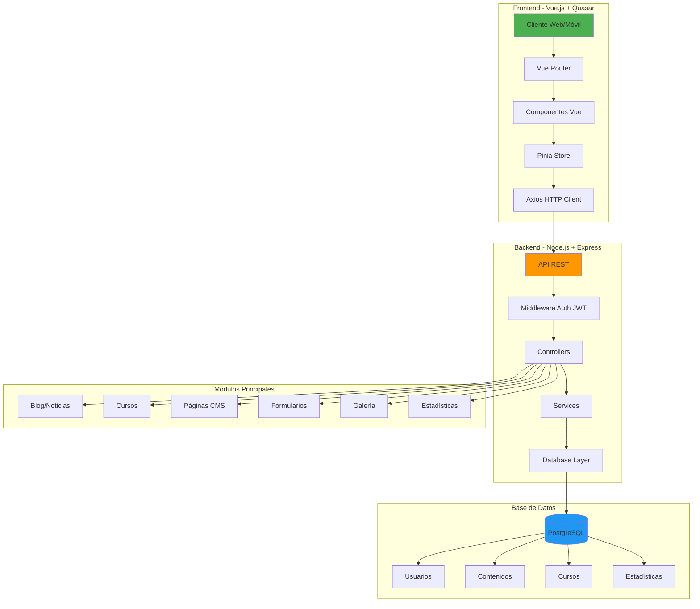

# Portal Web SIPPASE - Gestor de Contenidos basado en ROBITCMS

[](LICENSE)
[](https://nodejs.org/)
[](https://www.postgresql.org/)
[](https://vuejs.org/)
[](https://quasar.dev/)

## 📋 Descripción

**Portal Web SIPPASE** es un sistema integral de gestión de contenidos desarrollado como componente del SIPPASE (Sistema Integral de Presupuestos, Pagos y Seguimiento de Ejecución). El portal web proporciona información relacionada al estado de situación de violencia contra la mujer, incluyendo:

- 🆘 **Servicios de Ayuda**: Información sobre servicios de atención y apoyo
- 📚 **Gestor de Conocimientos**: Biblioteca de recursos y documentación
- 📊 **Estadística Oficial**: Datos y reportes sobre violencia de género
- 🎓 **Formación**: Cursos y materiales educativos
- 👥 **Promotoras**: Red de promotoras comunitarias
- 🔍 **Seguimiento a Denuncias**: Sistema de seguimiento de casos de violencia

### 🌐 Versión en Producción

El portal está publicado en: **https://portal.sippase.justicia.gob.bo/**

### 🏛️ Institución

Administrado por personal técnico de la **Dirección General de Prevención y Eliminación de Toda Forma de Violencia en Razón de Género y Generacional**, **Viceministerio de Igualdad de Oportunidades (VIO)** del **Ministerio de Justicia y Transparencia Institucional**.

## ✨ Características Principales

- 📰 **Gestión de Blog/Noticias**: Control completo del ciclo de publicación de noticias y artículos
- 🎓 **Cursos y Tutoriales**: Sistema de gestión de cursos, tutoriales y materiales de formación
- 📊 **Reportes y Estadísticas**: Dashboards interactivos y reportes personalizables
- 👥 **Gestión de Usuarios**: Sistema de roles y permisos granulares
- 📱 **Responsive**: Interfaz adaptable a dispositivos móviles y tablets
- 🔒 **Seguridad**: Autenticación JWT y control de acceso basado en roles
- 🌍 **Multilenguaje**: Soporte para múltiples idiomas
- 📄 **Gestión de Páginas**: Editor de contenido dinámico
- 🖼️ **Galería Multimedia**: Gestión de imágenes y videos
- 📋 **Formularios Dinámicos**: Constructor de formularios personalizados

## 🏗️ Arquitectura del Sistema



### Stack Tecnológico

#### Backend
- **Framework**: Node.js + Express 5.1.0
- **Base de Datos**: PostgreSQL 17.6
- **Autenticación**: JWT (JSON Web Tokens)
- **ORM/Cliente DB**: pg (PostgreSQL client)
- **Seguridad**: Helmet, CORS, bcryptjs
- **Validación**: express-validator
- **Upload**: Multer
- **Email**: Nodemailer

#### Frontend
- **Framework**: Vue.js 3.5.24
- **UI Framework**: Quasar Framework 2.18.6
- **Build Tool**: Vite 5.4.21
- **State Management**: Pinia 3.0.4
- **HTTP Client**: Axios 1.13.2
- **Router**: Vue Router 4.6.3
- **Editor**: TipTap (editor WYSIWYG)
- **Charts**: Chart.js + Vue-ChartJS
- **Validación**: Vuelidate

## 🚀 Instalación y Configuración

### Requisitos Previos

- **Node.js**: >= 16.0.0 (Recomendado: 24.11.0)
- **PostgreSQL**: >= 12.0 (Recomendado: 17.6)
- **npm**: >= 7.0.0 o yarn

### 1. Clonar el Repositorio

```bash
git clone https://github.com/gnuchrismo/SIPPASE-DEV.git
cd SIPPASE-DEV
```

### 2. Configurar Backend

```bash
cd backend
npm install

# Copiar archivo de configuración de ejemplo
cp .env.example .env

# Editar .env con tus credenciales
nano .env
```

**Configuración de `.env`:**

```env
# Database Configuration
DB_HOST=localhost
DB_PORT=5432
DB_NAME=sippase_db
DB_USER=tu_usuario
DB_PASSWORD=tu_contraseña

# Server Configuration
PORT=8001
NODE_ENV=development

# JWT Configuration
JWT_SECRET=tu_secreto_jwt_super_seguro_aqui
JWT_EXPIRES_IN=24h

# CORS Configuration
CORS_ORIGIN=http://localhost:5173

# Upload Configuration
UPLOAD_DIR=./uploads
MAX_FILE_SIZE=10485760
```

### 3. Configurar Base de Datos

```bash
# Crear base de datos
createdb sippase_db

# Ejecutar scripts SQL de configuración (si existen)
psql -d sippase_db -f db/schema.sql
psql -d sippase_db -f db/seed_data.sql
```

### 4. Iniciar Backend

```bash
# Modo desarrollo
npm run dev

# Modo producción
npm start
```

El backend estará disponible en `http://localhost:8001`

### 5. Configurar Frontend

```bash
cd ../frontend
npm install

# Copiar archivo de configuración de ejemplo
cp .env.example .env

# Editar .env con la URL del backend
nano .env
```

**Configuración de `.env`:**

```env
# API Configuration
VITE_API_URL=http://localhost:8001/api
VITE_AUTH_URL=http://localhost:8001/auth
VITE_BACKEND_URL=http://localhost:8001

# App Configuration
VITE_APP_NAME=Portal Web SIPPASE
VITE_APP_VERSION=1.0.0
```

### 6. Iniciar Frontend

```bash
# Modo desarrollo
npm run dev

# Build para producción
npm run build

# Preview del build
npm run preview
```

El frontend estará disponible en `http://localhost:5173`

## 📖 Documentación

### Estructura del Proyecto

```
SIPPASE-DEV/
├── backend/
│   ├── controllers/      # Controladores de la API (25 archivos)
│   │   ├── AuthController.js
│   │   ├── BlogController.js
│   │   ├── CourseController.js
│   │   ├── PageController.js
│   │   └── ...
│   ├── routes/           # Definición de rutas (25 archivos)
│   ├── middleware/       # Middlewares (auth, validation, etc.)
│   ├── services/         # Lógica de negocio
│   ├── utils/            # Utilidades y helpers
│   ├── db/               # Scripts SQL y configuración de BD
│   ├── server.js         # Punto de entrada del servidor
│   ├── package.json
│   └── .env.example
│
├── frontend/
│   ├── src/
│   │   ├── components/   # Componentes Vue reutilizables
│   │   │   ├── blog/
│   │   │   ├── courses/
│   │   │   ├── forms/
│   │   │   └── ...
│   │   ├── views/        # Vistas/Páginas principales
│   │   ├── router/       # Configuración de rutas
│   │   ├── stores/       # Stores de Pinia (state management)
│   │   ├── services/     # Servicios API
│   │   ├── assets/       # Recursos estáticos
│   │   └── utils/        # Utilidades
│   ├── public/           # Archivos públicos
│   ├── index.html
│   ├── vite.config.js
│   ├── package.json
│   └── .env.example
│
├── .gitignore
├── README.md
├── CONTRIBUTING.md
└── LICENSE
```

### Módulos Principales

#### 1. Blog/Noticias
- Creación y edición de artículos
- Categorías y etiquetas
- Programación de publicaciones
- Editor WYSIWYG

#### 2. Cursos y Tutoriales
- Gestión de cursos
- Módulos y lecciones
- Seguimiento de progreso
- Certificados

#### 3. Páginas CMS
- Editor de contenido dinámico
- Plantillas personalizables
- SEO optimizado
- Versionado de contenido

#### 4. Estadísticas
- Dashboards interactivos
- Reportes descargables
- Visualización de datos
- Filtros avanzados

#### 5. Formularios Dinámicos
- Constructor de formularios
- Validación personalizada
- Exportación de datos
- Notificaciones por email

## 🚢 Guía de Despliegue

### Despliegue en Servidor Linux (Debian/Ubuntu)

#### 1. Preparar el Servidor

```bash
# Actualizar sistema
sudo apt update && sudo apt upgrade -y

# Instalar Node.js
curl -fsSL https://deb.nodesource.com/setup_20.x | sudo -E bash -
sudo apt install -y nodejs

# Instalar PostgreSQL
sudo apt install -y postgresql postgresql-contrib

# Instalar Nginx
sudo apt install -y nginx

# Instalar PM2 (gestor de procesos)
sudo npm install -g pm2
```

#### 2. Configurar PostgreSQL

```bash
# Crear usuario y base de datos
sudo -u postgres psql

CREATE DATABASE sippase_db;
CREATE USER sippase_user WITH ENCRYPTED PASSWORD 'tu_contraseña_segura';
GRANT ALL PRIVILEGES ON DATABASE sippase_db TO sippase_user;
\q
```

#### 3. Desplegar Backend

```bash
# Clonar repositorio
cd /var/www
git clone https://github.com/gnuchrismo/SIPPASE-DEV.git
cd SIPPASE-DEV/backend

# Instalar dependencias
npm install --production

# Configurar .env
cp .env.example .env
nano .env

# Iniciar con PM2
pm2 start server.js --name sippase-backend
pm2 save
pm2 startup
```

#### 4. Desplegar Frontend

```bash
cd /var/www/SIPPASE-DEV/frontend

# Instalar dependencias
npm install

# Configurar .env para producción
cp .env.example .env
nano .env

# Build para producción
npm run build

# Los archivos estarán en dist/
```

#### 5. Configurar Nginx

```bash
sudo nano /etc/nginx/sites-available/sippase
```

**Configuración de Nginx:**

```nginx
# Backend API
server {
    listen 80;
    server_name api.portal.sippase.justicia.gob.bo;

    location / {
        proxy_pass http://localhost:8001;
        proxy_http_version 1.1;
        proxy_set_header Upgrade $http_upgrade;
        proxy_set_header Connection 'upgrade';
        proxy_set_header Host $host;
        proxy_cache_bypass $http_upgrade;
        proxy_set_header X-Real-IP $remote_addr;
        proxy_set_header X-Forwarded-For $proxy_add_x_forwarded_for;
    }
}

# Frontend
server {
    listen 80;
    server_name portal.sippase.justicia.gob.bo;

    root /var/www/SIPPASE-DEV/frontend/dist;
    index index.html;

    location / {
        try_files $uri $uri/ /index.html;
    }

    # Cache static assets
    location ~* \.(js|css|png|jpg|jpeg|gif|ico|svg|woff|woff2|ttf|eot)$ {
        expires 1y;
        add_header Cache-Control "public, immutable";
    }
}
```

```bash
# Habilitar sitio
sudo ln -s /etc/nginx/sites-available/sippase /etc/nginx/sites-enabled/
sudo nginx -t
sudo systemctl restart nginx
```

#### 6. Configurar SSL con Let's Encrypt

```bash
# Instalar Certbot
sudo apt install -y certbot python3-certbot-nginx

# Obtener certificados
sudo certbot --nginx -d portal.sippase.justicia.gob.bo -d api.portal.sippase.justicia.gob.bo

# Renovación automática
sudo certbot renew --dry-run
```

### Despliegue con Docker (Opcional)

**Dockerfile Backend:**

```dockerfile
FROM node:20-alpine
WORKDIR /app
COPY package*.json ./
RUN npm install --production
COPY . .
EXPOSE 8001
CMD ["node", "server.js"]
```

**Dockerfile Frontend:**

```dockerfile
FROM node:20-alpine as build
WORKDIR /app
COPY package*.json ./
RUN npm install
COPY . .
RUN npm run build

FROM nginx:alpine
COPY --from=build /app/dist /usr/share/nginx/html
EXPOSE 80
CMD ["nginx", "-g", "daemon off;"]
```

**docker-compose.yml:**

```yaml
version: '3.8'

services:
  postgres:
    image: postgres:17
    environment:
      POSTGRES_DB: sippase_db
      POSTGRES_USER: sippase_user
      POSTGRES_PASSWORD: ${DB_PASSWORD}
    volumes:
      - postgres_data:/var/lib/postgresql/data
    ports:
      - "5432:5432"

  backend:
    build: ./backend
    ports:
      - "8001:8001"
    environment:
      DB_HOST: postgres
      DB_PORT: 5432
      DB_NAME: sippase_db
      DB_USER: sippase_user
      DB_PASSWORD: ${DB_PASSWORD}
      JWT_SECRET: ${JWT_SECRET}
    depends_on:
      - postgres

  frontend:
    build: ./frontend
    ports:
      - "80:80"
    depends_on:
      - backend

volumes:
  postgres_data:
```

## 🧪 Testing

### Backend

```bash
cd backend
npm test
```

### Frontend

```bash
cd frontend
npm test
```

## 🤝 Contribuir

¡Las contribuciones son bienvenidas! Por favor lee [CONTRIBUTING.md](CONTRIBUTING.md) para conocer el proceso de contribución.

### Proceso Rápido

1. Fork el proyecto
2. Crea tu rama de feature (`git checkout -b feature/AmazingFeature`)
3. Commit tus cambios (`git commit -m 'feat: Add some AmazingFeature'`)
4. Push a la rama (`git push origin feature/AmazingFeature`)
5. Abre un Pull Request

## 📝 Convenciones de Código

- **JavaScript**: ESLint + Prettier
- **Commits**: Conventional Commits (`feat:`, `fix:`, `docs:`, etc.)
- **Branches**: `feature/`, `fix/`, `docs/`, `refactor/`

## 🐛 Reportar Bugs

Si encuentras un bug, por favor abre un [Issue](https://github.com/gnuchrismo/SIPPASE-DEV/issues) con:

- Descripción clara del problema
- Pasos para reproducir
- Comportamiento esperado vs. actual
- Screenshots (si aplica)
- Versión del navegador/Node.js
- Logs relevantes

## 📄 Licencia

Este proyecto está bajo la Licencia MIT - ver el archivo [LICENSE](LICENSE) para más detalles.

## 👥 Autores y Colaboradores

- **Christian Mollo** - [@gnuchrismo](https://github.com/gnuchrismo) - Desarrollo Principal

### Institución

**Dirección General de Prevención y Eliminación de Toda Forma de Violencia en Razón de Género y Generacional**  
**Viceministerio de Igualdad de Oportunidades (VIO)**  
**Ministerio de Justicia y Transparencia Institucional**

## 🙏 Agradecimientos

- Equipo técnico del VIO
- Comunidad de Vue.js y Quasar
- Todos los contribuidores al proyecto
- Personal de la Dirección General de Prevención y Eliminación de Violencia

## 📞 Contacto y Soporte

- **Email**: gnuchrismo@gmail.com
- **GitHub Issues**: [SIPPASE-DEV Issues](https://github.com/gnuchrismo/SIPPASE-DEV/issues)
- **Portal Oficial**: https://portal.sippase.justicia.gob.bo/

## 🔗 Enlaces Útiles

- [Documentación de Vue.js](https://vuejs.org/)
- [Documentación de Quasar](https://quasar.dev/)
- [Documentación de Express](https://expressjs.com/)
- [Documentación de PostgreSQL](https://www.postgresql.org/docs/)

---

**Nota**: Este es un repositorio público para desarrollo y colaboración. No incluye datos sensibles ni configuraciones de producción. El código fuente está disponible para que el personal técnico pueda descargar, estudiar y proponer mejoras.
